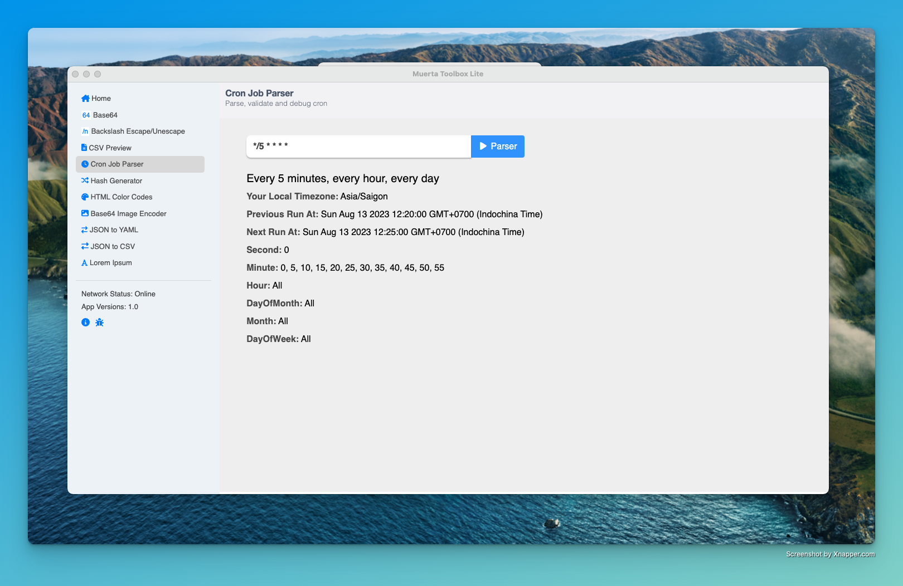

# Muerta Toolbox App Lite



## Install

Clone the repo and install dependencies:

```
  git clone --depth 1 --branch main git@github.com:MuertaToolbox/Muerta-Toolbox-App-Lite.git your-project-name
  cd your-project-name
  npm install
```

## Starting Development

Start the app in the dev environment:

```
  npm start
```

## Packaging for Production

To package apps for the local platform:

```
  npm run package
```
